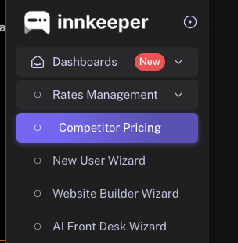

# Final Sprint Until Launch

## Objective
We are on a fast track to release to our initial 100 users in just 48 hours. Before we can do this, there are two important features that need to be implemented/refined.   

Goal 1: Transform any abritrary search result into a structured JSON format with hotel data. For example, a search term like ""Budget Inn Anaheim near Disneyland" may be transformed into a JSON in the following format:
```json
{
  "id": 238625,
  "address": "1042 West Ball Road",
  "city": "Anaheim (California)",
  "countryCode": "us",
  "pageName": "budget-inn-anaheim",
  "ufi": 20011324
  "...potentially more data fields"
}
``` 

- see scrape_search/index.js 
- run this file to get a sample of the data
- You are provided with a few required fields to get. This question is open ended. If there are more fields that would be useful for us to know about a hotel, include those terms.

Goal 2: Review New User Wizard is ready for launch  
https://pr-53.d3885mz1v6rc6h.amplifyapp.com/dashboards/new-user-wizard  

**Your Submission will be in the form of a PR to this repo**

## Project Goals:  
### Goal 1: 
- Analyze the HTML output generated by sample search terms
- Build a solution that can go from search term --> correct data. **Remember that is your primary goal and there are NO other rules.** You do not need to follow the method in index.js at all. 

**Relevant Materials** 

Sample data for search term "Budget Inn Anaheim near Disneyland" is provided to you in scrape_search/index.js

**Required Outputs** 
1. **Solution**: Provide your solution as a single file or a set of files, clearly commenting your code to explain your logic. Provide this in scrape_search/
2. **Answer.md**: fill out Answer.md in Answer.md document that outlines how to run your script, any dependencies, and any assumptions you've made during the development process. Please note where and why you used AI tools for certain tasks (this is highly encouraged)

### Goal 2:  
- Conduct a through analysis of the current UI. Look at all the components we have available and come up with 2-5 product ideas.
- Suggest Improvements that can be implemented in the next week before launch 

**Relevant Materials**
1. https://pr-53.d3885mz1v6rc6h.amplifyapp.com 
- pages: 


2. Database Schema: The schema of the current database table used by the onboarding wizard page.

**Required Outputs**
1. **Analysis/Commentary** in frontend/Answer.md on commentary on existing pages. You should utilize Chrome DevTools (console, sources, network tabs, etc.) to make conclusions about the current implementation. 
2. **Recommendation on enhancements** in frontend/Answer.md. This includes but is not limited to: 
    - User Interface Improvement 
    - User Experience Enhancements 
    - Technical Optimizations (raw speed improvements, code structure, etc.)
    - For each suggestion, detail the problem it solves or the value it adds, how it can be implemented (including code snippets, schema modifications, or rough mockups as appropriate), and the expected impact on the user experience or business value.
3. **List any assumptions you've made** in frontend/Answer.md. Include things you would do if given more time or if you were in the actual role. 
4. **Code Improvements**
    - For your suggestions if some pseudocode can be provided (mock nextjs backend endpoints) feel free to do so
    - You may add or remove anything you want. Full control over the entire repo you see in chrome dev tools.
    - If your suggestions cannot be directly reflected in the psuedocode (e.g., database schema modifications, frontend/backend architecture adjustments), please describe these in as much detail as possible.

## Support 
You may email any questions you havev throughout the allocated time. 

### Questions to Consider
- How is the experience from first login? 
- Consider the end user. How can the visual design and layout be optimized to make the wizard more engaging and easier to follow for our non-tech-savvy audience?
- Consider what this startup is and who it is for. What would this customer want?

## Evaluation Criteria
Your solution will be assessed based on:
- **Simplicity**: The ease of understanding and maintaining your code, and ability to be integrated into a production backend
- **Correctness**: How accurately your solution extracts and structures the data.
- **Runtime Speed**: The efficiency and productionalizability of your solution. Avoid using online code editors like Replit, as they may produce inconsistent responses.
- **Output Quality** the data we want + additional fields that are useful to us
- We value concise, impactful suggestions over exhaustive documentation. Show us your thought process and the rationale behind each of your recommendations clearly and succinctly.
- Quality product ideas - Do you understand what potential users want and if not how to find quality info on what they do want?

Include all notes, code files, and any additional materials you prepared as part of your analysis. Feel free to add your notes and answers to this Answer.md directly or link to a google doc here: __googledoc__
Add a 1-2 sentence overview of where and how you used AI tools + your research process if any. 

Good luck! 
 